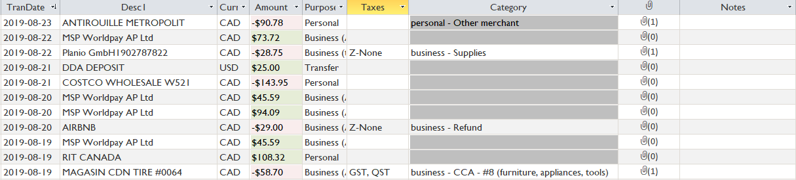
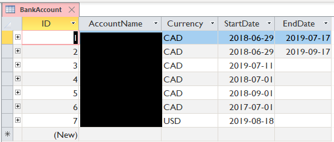

# Self-Employed Ledger

Easy accounting for self-employed person based on Microsoft Access. (When you buy everything from one or two credit cards, it's important to keep track!)

You'll need to adapt some VBA code to your cases. So you should somewhat be a coder yourself!

## Why Microsoft Access?

Despite being a proprietary software, Microsoft Access is a reliable and easy-to-use tool to manage SQL-based data structures. It is also a part of Office 365 subscription.

## Features

  - All the Access functionalities, for sure! (sorting, filtering, etc.)
  - Import and keep track of bank CSV to avoid duplicate entries. (CSV format customizable with VBA code)
  - Categorize income/expenses with both purpose (to separate areas of business) and category (to help with tax filing). Example:
    - Personal x Medical expenses
    - Business #1 x Advertising
    - Business #2 x Property taxes
  - Label income/expenses with sales taxes.
  - Attach invoices to entries.
  - Restricted editing to avoid accidental changes to date, description, amount, etc.
  - Manual splitting of an entry when needed (example: splitting CCA and ongoing expenses purchased together).
  
In the future as I continue to use it, you can expect:

  - Overview of a certain period
  - Tax filing preparation
  - Data validation against contextural constraints
  - Track of CCAs (business inventory)

## Usage

### 1. Getting started

Open the template file with Microsoft Access and follow the prompt to create your database file. You'll see all the tables, forms and modules on the left, but without any data. We need some groundwork to set it up for your use case.

#### 1.1 Define expense types

Open `ExpenseType` table, and create: `personal`, `business`, `transfer`, `exclude`. (Don't need to separate your businesses now - see next step.)

#### 1.2 Define expense purposes

This is where you split your businesses, or even personal spendings. Enter `PurposeName`, select an `ExpenseType`, and set an `Order` as integer as a preferred ordering in ledger interface later on.

Example:

#### 1.3 Define expense categories

Check with your tax bureau for the expense categories that you need to pull out for both `personal` and `business`, and enter them into the table `Category`.

Example setup in Quebec, Canada:

#### 1.4 Define payable/collectible sales taxes

Same as 1.3, check with your tax bureau for the sales taxes you may be paying or collecting, and enter them into the table `Tax`.

Example setup in Quebec, Canada:

#### 1.5 Enter your banking accounts

Enter all the banks you want to track into the table `BankAccount`, both debit and credit accounts. The `StartDate` and `EndDate` are not important right now (but may be validated against imported CSV in the future).

Example:

### 2. Import CSV

Now you're all set! The next step is to import CSV files via the form interface:

#### 2.1 Adapt VBA code to work with the CSV files from your bank (it's not hard, trust me)

To make it work with your bank, you will need to edit the VBA code by double-clicking the module `Converted Macro- DoImportCSV` (certainly, I'll clean this name later). 

Press Ctrl-F and find with `If acName`. The cursor will highlight the condition branches reading the bank that you're selecting. If you don't see the bank that you are using, go ahead and add yours into the `If` block. What you will need to change here are:

  - The condition (`acName like ...` or `acName = ...`); and
  - The name of function (`ImportXXXXCSV`).
  
Then, go to the bottom of the code, copy the last `Private Function` block (from `Private Function` until `End Function`), and duplicate it.

*First*, adapt the name of function (the same as what you just changed above, `ImportXXXXCSV`). You will need to adapt the 1st line (`Private Function ImportXXXXCSV(.....`) and the last line above `End Function` (`Set ImportXXXXCSV = DataLines`).

*Second*, open your CSV file exported from your bank (if your bank only provides PDF statements, see "FAQ" section below), and specify from which column you can extract following information:
 
  - Date of transaction: easier to be all-numerical, like `2019-06-01` or `6/1/2019` or so. A difficult one would be `Jun 1 2019` which needs more difficult VBA code to parse, depending on your coding level.
  - Description line 1
  - Description line 2: this could be empty, or could be assembled from multiple fields, as long as it will help you later on.
  - Amount: some banks separate debits and credits into two columns. Keep in mind, what you earn will be entered positive, and what you spend will be negative.
  
*Finally*, adapt the private function `ImportXXXXCSV`. In preset examples, you will find:

  - How to skip the header row;
  - How to parse a `YYYY-mm-dd` formatted date and build VBA date object;
  - How to build a decimal object for the amount.
  
Keep in mind:
  
  - Look for `dict("tranDate")`, `dict("desc1")`, `dict("desc2")`, and `dict("amount")`.
  - `Items(1)` corresponds to the value of *first* column of the CSV file.

Good luck!

#### 2.2 Import your CSV file

Close the CSV file you're importing if it's opened by Excel. Double-click "Import CSV" form, select the correct account name, choose the CSV file, and hit `Import`. If successful, you will be prompted:

  - The number of entries imported;
  - The start date of this batch of import;
  - The end date of this batch of import.
  
To verify, double-click `BankCSV` table, and you will see a new record there with the CSV file you just imported. 

### 3. Review imported entries

Open `Ledger Input` form, and you will see an editable datasheet containing all the entries ever imported (or directly created in `Ledger` table if you did). You will be able to edit purpose, taxes, category, notes and invoice and other fields are locked.

If you need more edits, double-click to open `Ledger` table and edit there. But keep in mind that you may accidentally touch the locked fields on the other view. Just be careful.

## FAQ

### What if my bank doesn't provide CSV exports?

It is more difficult, but you still have a few options:

- If there's a table on the web page, try to copy and paste it into Excel and save as CSV there.
- If you only have PDF statements, you'll need some extra work to parse them as CSV. A possible workflow is to 1) concatenate all PDF files into a monolithic one; 2) find a PDF-Excel converter (for example, Foxit online PDF tool); 3) parse that Excel. Or if you're confident, parse the PDFs directly. Either way, you'll have to be good at scripting.
