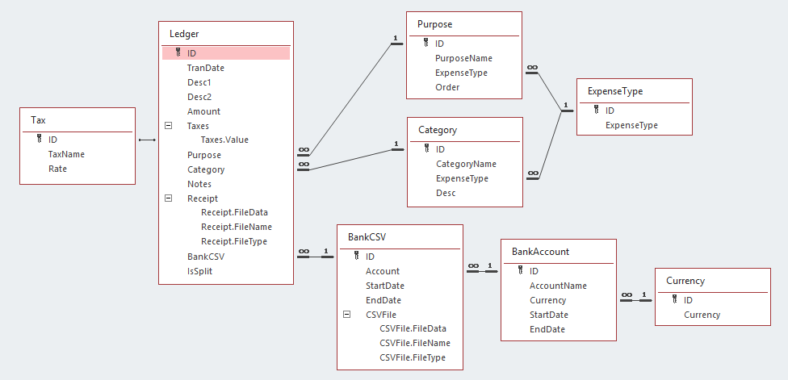

# Self-Employed Ledger

:ledger: Easier accounting for self-employed hero. It is a Microsoft Access template for quickstart!

### Why Microsoft Access?

Despite a proprietary software, Microsoft Access is reliable and easy-to-use and comes with Office 365 subscription.

### Database ERD

### Design Ideas

- **Bank CSV** is the source of truth. (:wrench: You'll need to adapt VBA code snippets. It's easy, trust me.)
- **Editing mode** avoids accidental changes to imported date, description, amount, etc.
- **Two-dimensional categorization** of income and expenses:
  - **Purpose**: to delimit personal/business/transfer, and separate areas of business
  - **Category**: to help with local tax filling (medical expenses, advertising, property taxes, CCA, etc.)
- **Electronic invoices** attached in place.
- **Sales taxes** setup is flexible.
- **Multi-currency support** on bank account level.
- Dirty work goes manually: e.g., splitting a transaction into two entries.

### Steps to Follow

1. Create your Microsoft Access database from the `.accdt` template file.

2. Define base data that makes sense for your local use: ([example setup](docs/Base-Data-Example.md))

   - Expense types
   - Expense purposes
   - Expense categories
   - Payable/collectible sales taxes
   - Banking accounts

3. Adapt VBA code in macro `DoImportCSV` to work with the CSV format from your bank.

   - Reference: [VBA Programming Guide](docs/VBA-Programming-Guide.md)

4. Import your CSV file via "Import CSV" form.

5. Review and label import entries.

### Changelog & Roadmap

[Changelog](CHANGELOG.md)

Roadmap: please see "Issues" tab.
