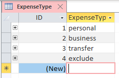
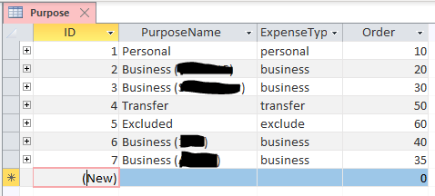
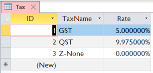

## Example of base data setup

#### 1.1 Define expense types

Open `ExpenseType` table, and create: `personal`, `business`, `transfer`, `exclude` and `mixed`. (Don't need to separate your businesses now - see next step.)

#### 1.2 Define expense purposes

This is where you split your businesses, or even personal spendings. Enter `PurposeName`, select an `ExpenseType`, and set an `Order` as integer as a preferred ordering in ledger interface later on.

Example:

#### 1.3 Define expense categories

Check with your tax bureau for the expense categories that you need to pull out for both `personal` and `business`, and enter them into the table `Category`.

Example setup in Quebec, Canada:

#### 1.4 Define payable/collectible sales taxes

Same as 1.3, check with your tax bureau for the sales taxes you may be paying or collecting, and enter them into the table `Tax`.

Tip: set up a `Z-None` item to label tax-exempt purchases, to remind that we have reviewed the invoice.

#### 1.5 Enter your banking accounts

Enter all the banks you want to track into the table `BankAccount`, both debit and credit accounts. The `StartDate` and `EndDate` are not important right now (but may be validated against imported CSV in the future).

Example:

